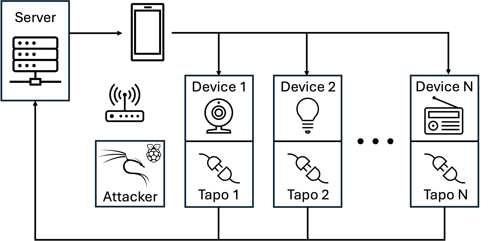
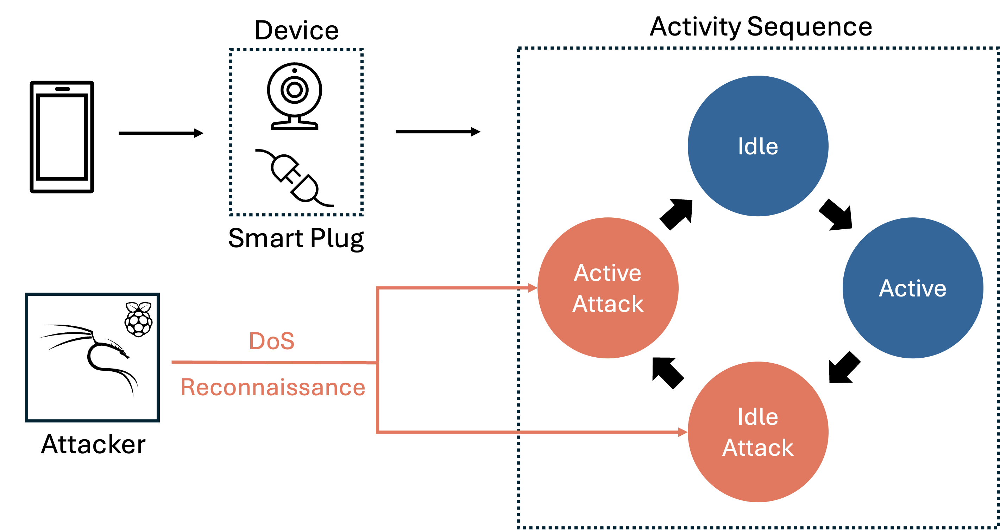

# Catching Hackers by Watching Watts: A Measurement Study of Power-Only Attack Detection on Consumer IoT Devices

This repository contains the code and analysis used in the study Catching Hackers by Watching Watts.
The project investigates whether network attacks on consumer IoT devices can be recognised from power consumption signals alone.
Power traces and background traffic are collected in a controlled testbed, converted into lightweight statistical features and classified at window level.
The analysis explores detection feasibility, activity induced masking and the physical and network factors that influence reliability.

<p align="center">
   
</p>

*Left:* Overview of the IoT testbed Testbed     *Right:* Overview of the datacollection methodology

## Environment Setup
Install the required Python libraries with
```
pip install -r requirements.txt
```

## Key Components
### Data collection
The testbed records one hertz power measurements from smart plugs and full packet captures from the local gateway across idle, active, idle attack and active attack conditions.

### Feature extraction
Raw power sequences are segmented into short overlapping windows and summarised with simple statistical features that capture consumption patterns.

### Classification
Per device models learn to separate benign and malicious windows and support evaluation across categories such as bulbs, appliances, speakers, cameras and televisions.

### Analysis notebooks
RQ2 and RQ3 notebooks examine masking behaviour during activity and the influence of background traffic.
